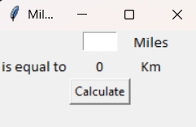

# 🚗 Mile to Km Converter (Tkinter GUI)
This is a simple Python GUI application that converts distance from Miles to Kilometers using the tkinter library.

---

# 📌 Features
- Clean and minimal graphical interface.

- Instant conversion from Miles to Kilometers.

- Input validation using basic Python functions.

- Uses standard tkinter widgets like Label, Entry, and Button.

---

# 💻 How It Works
- The user inputs a value in Miles.

- Upon clicking the "Calculate" button, the program multiplies the entered value by 1.60934 to convert it to Kilometers.

- The converted value is displayed in real-time in the GUI.

---

# 🛠️ Requirements
- Python 3.x

- No external libraries needed — uses only built-in tkinter.

---

## 📸 Demo

----

# Thank You
Happy Coding!!

Abhijeet--
